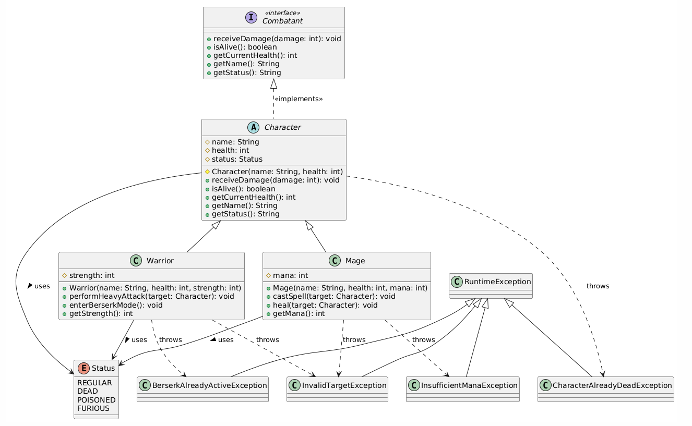

# RetoBit: RPG: Control de errores 🙈

Seguimos con el RetoBit del RPG. Esta vez añadiremos excepciones para que nuestro juego sea más fiable y no se rompa todo ante cualquier pequeño error.

## ¿Qué practicarás?

- Excepciones personalizadas
- Interpretar diagramas UML
- Detección de errores
- Desarrollar a partir de tests (Test Driven Development)

## Fork del repositorio:

Haz un fork del repo.

Pulsa el botón Fork en github:


Esto creará una copia del repositorio en tu perfil de Github. 

## Clona el repo en tu computadora

Ahora hay que descargarse el proyecto en tu computadora.

### 1. Asegúrate de que estás en la URL de TU copia del repositorio
   

Si la URL es esta: https://github.com/curso-java-marshall-bits/retobit-RPG-exceptions **NO ES CORRECTO**.
    

Donde aparece 'curso-java-marshall-bits' debería aparecer tu nombre de usuario. Haz click en tu perfil y mira tus repositorios para comprobar si hiciste el fork. En caso contrario vuelve al paso anterior. 


### 2. Pulsa en "code" para ver la URL del repositorio y cópiala


Para ello deberás abrir una terminal y navegar a la carpeta donde quieras añadir este retoBit.

Utiliza el siguiente comando:

```commandline
git clone https://aqui.debes.pegar.la.url
```

**Nota: Después del 'git clone' debes pegar la url del repositorio. No pongas la que he puesto yo en el ejemplo 🤣*

Ahora se va a crear un nuevo directorio con el nombre del retobit.

### 3. ¡Ya puedes abrir este reto en IntelliJ!

# Instrucciones

## Parte 1: Interpretar la actualización del diagrama UML

Nuestro manager nos ha pasado el diagrama actualizado por la Tech Lead:



Nos indica que nuestra tarea es generar todas estas excepciones para cada una de las clases. Así que iremos por partes.

## Parte 2: Crear y añadir las excepciones

Para poder ver todos los tests te recomiendo que crees todas las excepciones antes de añadirlas a los métodos.

1. **BerserkAlreadyActiveException** en Warrior: Esta excepción se debe lanzar cuando se trata de ejecutar el método *enterBerserkMode*, pero el warrior ya está en ese estado. El mensaje de la excepción deberá ser exactamente: *nombreDelWarrior ya está en modo furioso*. Sé que parece obvio 😅, pero allá donde pone *nombreDelWarrior* deberá salir el nombre del warrior. 

2. **InsufficientManaException** en Mage: Cuando queramos lanzar un hechizo con *castSpell* y no tengamos suficiente maná, lanzaremos la excepción con el mensaje: *nombreDelMago no tiene maná suficiente* 

3. **InvalidTargetException**: En este caso la excepción es más común y se va a utilizar en las dos clases, tanto la de Warrior como la de Mage. Cuando tengamos un método que contiene un *target*, ya sea para atacar o para curar, debemos asegurarnos que el target no es **null**. En caso de que el target sea **null** mandaremos esta excepción con el mensaje: *No se puede realizar una acción a un objetivo nulo*

4. **CharacterAlreadyDeadException** en Character: Si se aplica un método a un Character y este ya está muerto deberíamos lanzar esta excepción. El mensaje que añadiremos será: *nombreDelCharacter ya está muerto*

## Testing

Para comprobar si has realizado bien el ejercicio ejecuta los tests. Pulsa con el botón derecho en el directorio **src/test/java** seleccionando la opción 'Run tests in Java'. 

El test te indicará si has pasado con un tick verde ✅. En caso contrario verás el error.

Ejemplo:


Pulsa en cualquiera de los tests que has fallado y mira el mensaje de la derecha.

- *Expected*: es el valor que el test estaba esperando.
- *Actual*: es el valor que tu reto está retornando. 

## Solución

Si quieres ver una posible solución para el retoBit que pasa todos los tests puedes mirar la rama *solution* dentro del repositorio.


Ten en cuenta que hay muchas formas de resolver los ejercicios y la tuya puede pasar los tests iguales, pero ser completamente distinta a la solución. No significa que la tuya esté mal. Compara los resultados y decide cuál te gusta más o te parece más legible.

## Entrega

Realiza un commit con los cambios desde la terminal:

1. Añade todos los cambios
````commandline
git add .
````

2. Haz el commit con el mensaje
````commandline
git commit -m "retobit finalizado"
````

3. Haz un push
````commandline
git push origin main
````

Debes realizar una pull request para entregar el ejercicio. Abre el link del repositorio en github y haz click en la pestaña *pull requests*.

Selecciona *New pull request*, *Create pull request* y confírmala. Esto hará que yo pueda verlo y revisarlo en caso de que haya fallado algún test para poder darte feedback.

Mucha suerte con el reto. Te mando un abrazo y ¡Sigamos desarrollando! 🫂

[marshall-bits.dev](http://marshall-bits.dev)

*Nota: Estos retos pertenecen al curso de Marcel Bosch de Java para desarrolladores junior. Cualquier uso fuera de este contexto debe estar autorizado explícitamente. Si quieres usar estos ejercicios ponte en contacto conmigo a través de mis redes sociales (visita mi página para [más información](http://marshall-bits.dev)).* 